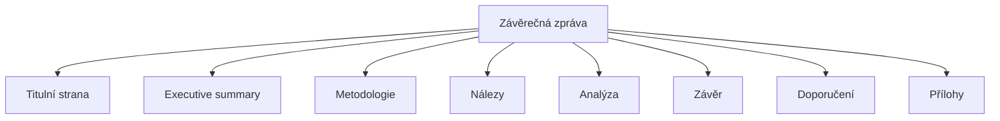

# 13.5 Závěrečná zpráva

> **Cíle kapitoly:**
>
> - Umět napsat závěrečnou zprávu
> - Znát strukturu profesionální zprávy
> - Umět prezentovat nálezy

---

## Teorie

### Struktura závěrečné zprávy



### Co každá sekce obsahuje

| Sekce | Obsah |
|---|---|
| **Titulní strana** | Název, datum, autor, klasifikace |
| **Executive summary** | Shrnutí (max 1 strana) |
| **Metodologie** | Použité nástroje a techniky |
| **Nálezy** | Fakta bez interpretace |
| **Analýza** | Interpretace, vztahy, vzorce |
| **Závěr** | Odpověď na výzkumnou otázku |
| **Doporučení** | Další kroky |
| **Přílohy** | Surová data, screenshoty |

### Formát

```bash
# PDF je standard
# Profesionální formátování
# Hlavička: DŮVĚRNÉ/NEFORMÁLNÍ
# Číslování stránek
```

---

## Postup krok za krokem: Psaní zprávy

### 1. Executive summary

```bash
# Kdo? Co? Kdy? Kde? Proč?
# Max 1 odstavec
# Pro manažery
```

### 2. Nálezy

```bash
# Pouze fakta
# Žádná interpretace
# Chronologicky nebo tematicky
```

### 3. Analýza

```bash
# Interpretace nálezů
# Confidence level
# Link analysis
# Časová osa
```

### 4. Závěr

```bash
# Odpověď na výzkumnou otázku
# Shrnutí klíčových zjištění
# Následující kroky
```

---

## Praktické cvičení

**Úkol:** Napište závěrečnou zprávu:
1. Vyberte si cvičení z této učebnice
2. Napište zprávu podle struktury výše
3. Zahrňte executive summary, nálezy, analýzu, závěr

**Očekávaný výstup:** Závěrečná zpráva (2-3 strany)

---

## Shrnutí

- Struktura: titulní → executive summary → nálezy → analýza → závěr
- Executive summary pro manažery (max 1 strana)
- Fakta oddělujte od interpretace
- Uvádějte confidence level
- PDF formát, profesionální vzhled

---

## Kontrolní otázky

1. Jaká je struktura závěrečné zprávy?
2. Co obsahuje executive summary?
3. Jaký je rozdíl mezi nálezy a analýzou?
4. Proč uvádět confidence level?
5. V jakém formátu zprávu prezentovat?
