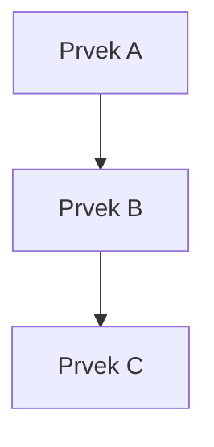

# [Název kapitoly]

> **Cíle kapitoly:**
>
> - Cíl 1
> - Cíl 2
> - Cíl 3

---

## Teorie

### [Koncept 1]

Výklad konceptu...

### [Koncept 2]

Výklad konceptu...

---

## Postup krok za krokem

1. **Krok 1** — popis
2. **Krok 2** — popis
3. **Krok 3** — popis

---

## Reálné příklady

### Příklad 1: [Název]

**Zadání:** ...

**Postup:** ...

**Výsledek:** ...

---

## Tipy a časté chyby

> [!TIP]
> Užitečná rada...

> [!WARNING]
> Častá chyba, které se vyvarovat...

---

## Praktické cvičení

**Úkol:** ...

**Pomůcky:** ...

**Očekávaný výstup:** ...

---

## Shrnutí

- Klíčový bod 1
- Klíčový bod 2
- Klíčový bod 3

---

## Kontrolní otázky

1. Otázka 1?
2. Otázka 2?
3. Otázka 3?

---

## Zdroje a odkazy

- [Název zdroje](URL)
- [Název zdroje](URL)
